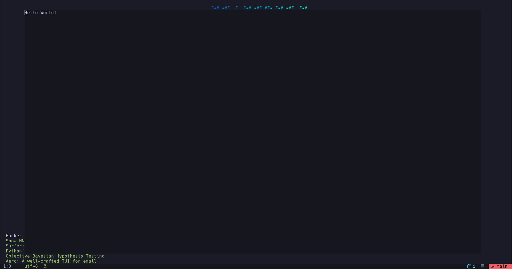
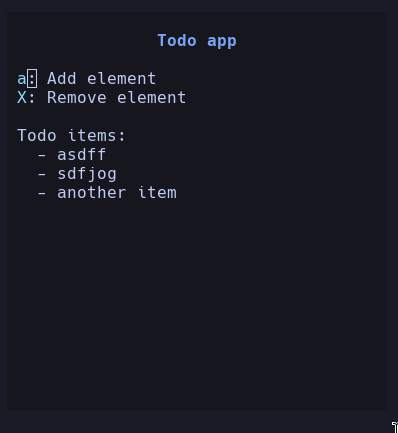
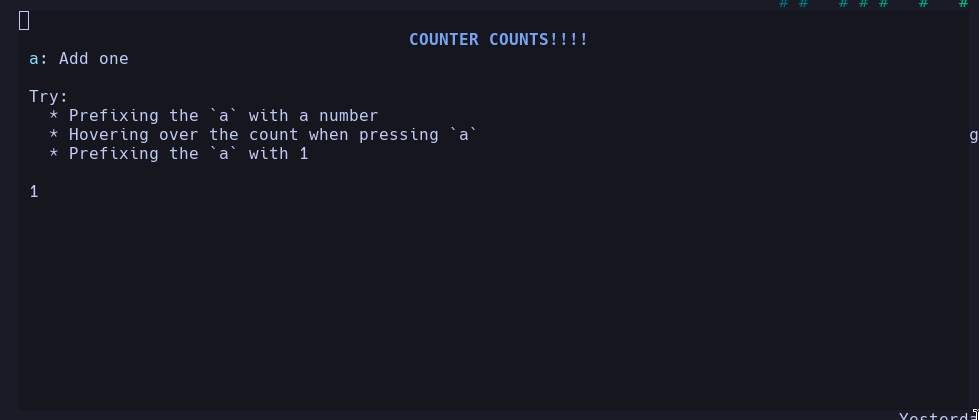
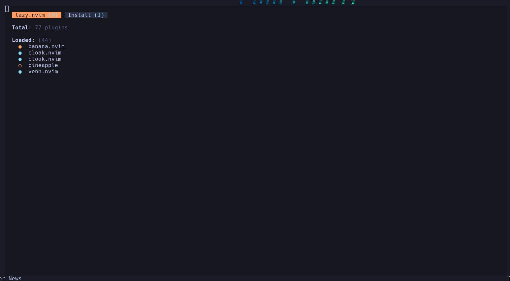
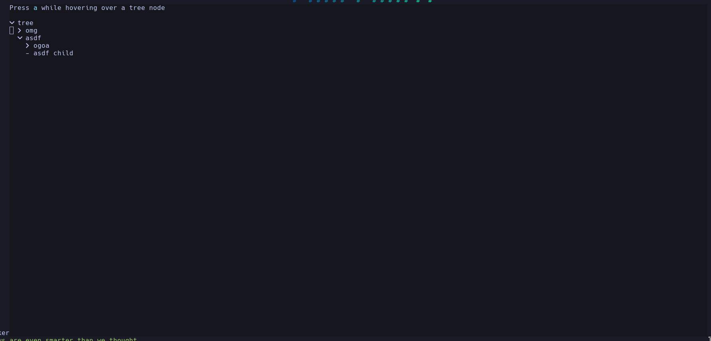

# Banana.nvim

A blazingly fast html renderer for neovim

> [!CAUTION]
>
> This project is still in early development.  
> Expect breaking changes and bugs, and please report any issues you encounter.

> [!NOTE]
>
> If there is a css/html feature that is not currently implemented, please submit an issue and it should probably be implemented within a few days

## Example

This is the banana hello world:

```html
<nml>
  <!-- in banana/stuff/foo.nml -->
  <head>
    <style>
      nml {
        width: 75%;
        height: 75%;
        left: 12%;
        top: 12%;
      }
    </style>
  </head>
  <body>
    <div>Hello World!</div>
  </body>
</nml>
```

then in a lua file:

```lua
local instance = require('banana.instance').newInstance("stuff/foo", "random buffer name")
instance:open()
```

all of that code results in this window:



this may seem underwhelming as the above result can be done in a few lines of lua, but banana starts becoming extremely helpful when you start doing more complex rendering cases like nested tags, css grid display, or css flex display. For a better example, check out [banana-example](https://github.com/CWood-sdf/banana-example) or the other examples below

### Other examples

Currently there are four examples: a todo app, a partial clone of the lazy.nvim plugin, an example tree element, and a counter app.

The todo's files are contained in banana/example/todo.nml and lua/banana_example/todo.lua. You can run it with `require('banana').runTodo()`



The counter's files are contained in banana/example/counter.nml and lua/banana_example/counter.lua. You can run it with `require('banana').runCounter()`



Lazy's files are contained in banana/example/lazy/ and lua/banana_example/lazy/ and can be run with `require('banana').runLazy()`



The tree's files are contained in the same location as tree.nml and tree.lua and can be run with `require('banana').runTree()`



## Installation

> [!NOTE]
>
> Banana requires zig to be installed on your system

Banana can be installed like this in lazy:

```lua
return {
  "CWood-sdf/banana.nvim",
  dependencies = {
      "nvim-treesitter/nvim-treesitter",
  },
}
```

or it can be added as a dependency to your plugin.

There is no need to lazy load banana as all functionality inside the library is already lazy loaded

## Features

Partial or complete implementations exist for the following tags:

- div
- title
- h1
- script
- style
- meta
- ul
- ol
- li
- span

Html character entity support does not currently exist

Banana has added a very simple text templating system via the % character. Adding the text %asdf to an html element causes the renderer to replace %asdf with the value of the attribute 'asdf' in the first parent element that chas that attribute.

Partial or complete implementations exist for the following css properties (for the most uptodate list check lua/banana/ncss/validations.lua):

- hl-\* properties for highlighting (use the same properties as nvim_set_hl)
- hl-underline
- hl-italic
- hl-bold
- hl-fg
- hl-bg
- hl-link
- hl-\_\_name (allows named highlight groups)
- list-style-type (very partial)
- width
- height
- display (currently just flex, inherit, initial, and none) (block, inline... are not planned to be supported because banana only formats the tree once)
- flex-basis
- flex-shrink
- flex-grow
- flex-wrap
- text-align (missing justify)
- position (missing fixed and sticky)
- z-index
- left
- right
- top
- bottom
- padding
- padding-left
- padding-right
- grid-template-columns
- grid-template-rows
- grid-row
- grid-column
- padding-top
- padding-bottom
- margin
- margin-left
- margin-right
- margin-top
- margin-bottom

Implementations for the following selectors exist:

- pseudo class (currently supporting :not, :last-child, :first-child. for uptodate list, see lua/banana/ncss/queryParser.lua)
- universal (\*)
- descendant (space)
- tag name
- child selector (>)
- class
- id

Currently the following css functions are implemented (for uptodate list see cssFunctions variable in lua/banana/ncss/valueParser.lua):

- rgb()
- hl-extract() (to get the values from a neovim highlight group)
- linear-gradient() (missing color space support)
- radial-gradient() (missing color space support)

The following units are implemented (for uptodate list see M.calcUnitNoMod in lua/banana/nml/ast.lua):

- ch
- fr (only allowed in grid-template-rows and grid-template-columns)
- %

## Structuring plugins

Banana searches for all nml and ncss in the banana/ folder in the neovim require path (similar to the lua/ folder for plugins), thus your plugins can be structured like this:

```
∟ Plugin
    ∟ banana/
        ∟ pluginName/
            ∟ markup.nml
    ∟ lua/
        ∟ pluginName/
            ∟ plugin.lua
```

Requiring these markup files uses the slash seperator that links use (rather than the dot lua uses). The filenames index.nml and index.ncss are the "init.lua"s for banana. So to require the file in banana/plugin/index.nml, the require path would just be "plugin"; to require banana/plugin/other.nml, the require path would be "plugin/other".

When using Instance:loadNmlTo(), adding "?..." allows parameter passing in the same way browsers use it. This feature is currently not implemented in every load function, but it will happen eventually.

An example plugin, [banana-example](https://github.com/CWood-sdf/banana-example), exists that better shows how banana recommends plugins be layed out.

## Executing banana plugins

Opening a banana plugin is very simple:

```lua
-- the buffer name can be overriden using the <title> tag
local document = require('banana.instance').newInstance("banana require path", "initial buffer name")

-- opens the window
document:open()
```

## Scripting

There are two scripting methods available: separate lua files and embedded lua.

Of the two, separate lua files has much better support (lsp and parameter passing).

Loading a separate lua file into an nml document is very simple:

```html
<script src="lua require path"></script>
```

this will work if the script returns either a function or a table with a key of \_\_banana_run that is a function.

```lua
--- Add types for luals
---@param document Banana.Instance
---@param opts table
return function(document, opts)
    -- any params passed from ?param=value
    -- only supported on loadNmlTo currently
    local params = opts.params
    local element = document:getElementById("asdf")
end
-- also allowed
return {
  -- ... other keys
  __banana_run = function(document, opts)
    -- scripting code
  end,
}
```

Embedded lua is also very simple, banana predefines the document variable for you:

```html
<script>
  local element = document:getElementById("asdf")
</script>
```

## Api

The api is modeled very closely after the browser api, some extra functions might come later that make it also possible to use similar to jquery and/or htmx. Currently most of banana's internal api functions are listed as public, but start with an underscore; thus there are two rules for using the lua api:

- never use a function that starts with an underscore
- only use the api functions, never use a property. To be safe, only use : for field access

### Extra api functions

A banana nml ast node (dom element) has a function called attachRemap. This function enables two features:

- remaps bound to a certain ast are cleaned up when that ast is removed
- remaps that require hovering over the element are only called when that is the case

The attachRemap function is almost the exact same as vim.keymap.set, but with an extra third parameter which is an array of restrictions. The array of restrictions is currently OR'd together

```lua
local ast = document:getElementById("foo")

ast:attachRemap(
    "n", "<leader>a", { 1, "hover" --[[ "line-hover" is also an option ]]},
    function()
        print("Either you prefixed this map with 1, or are hovering over the element")
    end,
    {
        -- vim.keymap.set opts go here
        -- buffer is already set, a feature is needed to prevent auto setting
    }
)

```

## NEEDED DOCUMENTATION

- developing banana
- developing a banana plugin
- specifics about all the apis and stuff

## Contributing

There is a lot of work still to be done. If you want to help out, the primary areas work is needed in are:

- table rendering
- grid rendering
- gradients
- documentation
- tests
- apis
- extensibility

If you have a css/html feature that you really want implemented, post it in an issue and I will see what I can do. However, there are currently no plans to support jsx or the like because it will add a massive amount of complexity (in plugin dev's dx (lsp), my sanity (and dx), and probably the end user's experience too (perf issues)).

### Current roadmap

#### v0.1

Finish the grid renderer

#### v0.2

Rework how pages are used

Gradient support

## Final notes

As you can probably tell, this plugin is nowhere close to being done. If you would like to contribute to this plugin, by all means please do. If you don't want to contribute, but still find this project interesting, then give it a star. If you want to follow the progress, then "watch" it on github.

## Self promotion

Follow me on [x](https://x.com/CWood_sdf)

Try out my other two plugins: [spaceport](https://github.com/CWood-sdf/spaceport.nvim) and [pineapple](https://github.com/CWood-sdf/pineapple)

Follow me on github
