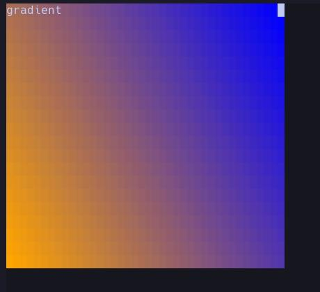

Highlights are done via the `hl-*` ncss properties that can be applied to elements.

For example, if you want to make all div's red background, then use the following style rule:

```css
div {
  hl-bg: red;
}
```

The property names given are passed directly to `nvim_set_hl`, so you can check `:help nvim_set_hl` to use those highlights.

## `hl-__name`

There is one additional property that can be added: `hl-__name`. This allows highlights groups to be named, and overriden by the user.

```css
div {
  hl-bg: red;
  hl-__name: Override;
}
```

This will set all divs background to be red unless this is called somewhere in lua:

```lua
vim.api.nvim_set_hl(0, "Override", {
  bg = "blue"
})
```

## gradients

Currently, linear and radial gradients are supported. Unlike in html, gradients can be applied both as a background _and_ foreground value

For `linear-gradient` every parameter possibility except for color space input are supported. The [mdn documentation](https://developer.mozilla.org/en-US/docs/Web/CSS/gradient/linear-gradient) should clarify any questions

For `radial-gradient`, the shape, size, and position parameters are not supported currently. See [mdn docs](https://developer.mozilla.org/en-US/docs/Web/CSS/gradient/radial-gradient) for more help.

Banana also does not support passing multiple gradients to one color field

```css
div {
  /* This is not allowed */
  hl-bg: linear-gradient(45deg, orange, blue)
    linear-gradient(90deg, white, black);
}
```

```nml
<nml>
  <head>
    <style>
    div {
      width: 40ch;
      height: 20ch;
      hl-bg: linear-gradient(45deg, orange, blue);
    }
    </style>
  </head>
  <body>
  <div> gradient </div>
  </body>
</nml>
```

the above code looks like:


